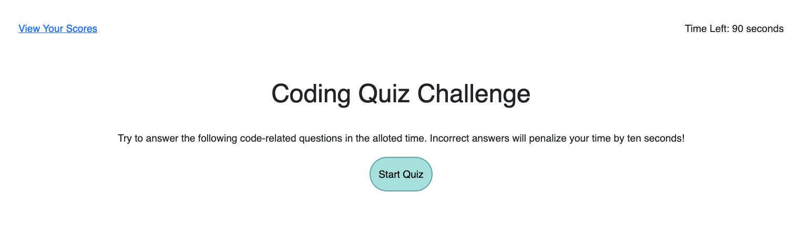

# Code Quiz

## Description

This application is a online quiz which tests the user's knowledge of JavaScript. By initiating the quiz, the 90 second timer begins ticking. With each wrong answer, 10 seconds are deducted from the timer. Once complete, the score is displayed and the user can submit their initials/score to local storage. All of the user's past scores are then displayed once they submit their initials.

### Application Functionality 
* When Start button is clicked:
    * The Main section is hidden
    * The timer function is called
    * The startQuiz function begings

* When a question is answered:
    * If correct, the "Correct!" feedback block appears, the next question appears, and 20 pts are added to your score.
    * If wrong, the timer decrements by 10 seconds, the "Incorrect" feedback block appears, and the next question appears.

* If the timer reaches 0, the quiz is over and your score is displayed.

* Once the quiz is complete or the timer reaches 0, the Quiz element is hidden and the Results element is shown. The user's score is presented, and they can submit their initials. The Scores element is then shown, displaying locally stored scores.
    * I used .toUpperCase() and .trim() in personScore.initials so that it coverts the user's initials to uppercase and removes any surrounding blank spaces.

* The user can retake the quiz by clicking Home in the nav, which refreshes the application.

* From the Home screen, the user can toggle to the Scores view by clicking "View Your Scores" in the nav. 

* I used media queries to make the quiz mobile friendly.

### Live Application
You can view the live application [here](https://mrpancakes.github.io/homework-04-code-quiz/), along with the GitHub repo [here](https://github.com/mrpancakes/homework-04-code-quiz).

